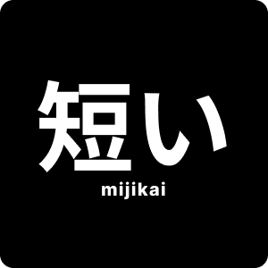
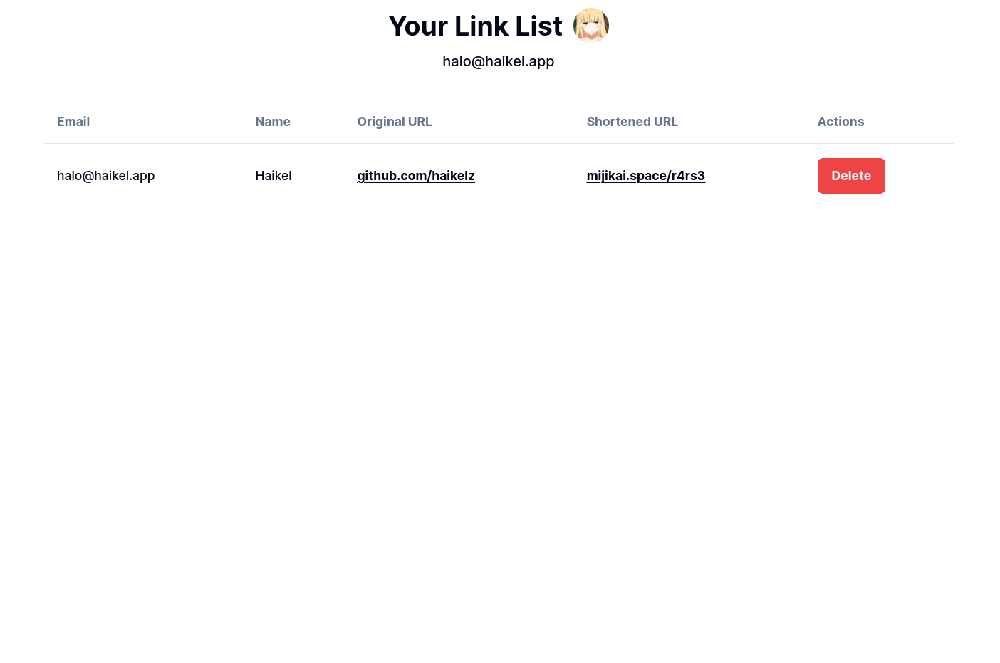

  
  <h1>Mijikai</h1>
  
Mijikai is a free shorten URL Website. <b>No ads, no tracker!</b>

## Features

- Shorten long URL
- Convert shortened URL to QR Code
- Custom URL slug
- Show users link list
- PWA

## Screenshots

## Tech Stack

- Next JS 13
- Tailwind CSS with shadcn/ui
- Jotai
- React Query
- Supabase

## Support

- [Github sponsor](https://github.com/sponsors/haikelz)
- [Trakteer](https://trakteer.id/haikelz/tip)

## License

Apache-2.0
